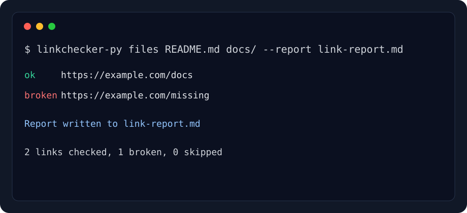

# linkchecker-py

[](https://github.com/jannis793/linkchecker-py/actions/workflows/ci.yml)
[](https://pypi.org/project/linkchecker-py/)
[](https://pypi.org/project/linkchecker-py/)
[](LICENSE)

`linkchecker-py` is a modern async CLI for finding broken links in Markdown files, HTML files, and small to medium websites. It is built for documentation maintainers who want fast checks locally, clean CI output, and reports they can paste into pull requests.



## Highlights

- Check Markdown and HTML files with a `src` layout Python package.
- Crawl websites with a same-origin depth limit.
- Validate HTTP status codes and URL fragments such as `#install`.
- Check local file links and generated Markdown heading anchors.
- Exclude noisy links with glob patterns.
- Control concurrency and rate limiting for polite checks.
- Respect `robots.txt` by default.
- Cache remote results between runs.
- Print Rich terminal tables and write JSON or Markdown reports.

## Install

Use `pipx` for the CLI:

```bash
pipx install linkchecker-py
```

For local development:

```bash
git clone https://github.com/jannis793/linkchecker-py.git
cd linkchecker-py
python -m venv .venv
. .venv/bin/activate
python -m pip install -e ".[dev]"
```

## Usage

Check a documentation folder:

```bash
linkchecker-py files README.md docs/
```

Write a Markdown report:

```bash
linkchecker-py files README.md docs/ --report link-report.md
```

Write a JSON report for CI artifacts:

```bash
linkchecker-py files docs/ --report link-report.json
```

Crawl a website up to depth 2:

```bash
linkchecker-py site https://example.com --depth 2
```

Skip links that are rate-limited or intentionally private:

```bash
linkchecker-py files docs/ --exclude "https://localhost/*" --exclude "*/private/*"
```

Be extra polite to a remote site:

```bash
linkchecker-py site https://example.com --depth 1 --concurrency 4 --rate-limit 1
```

Use cached remote results:

```bash
linkchecker-py files docs/ --cache
```

## Reports

JSON reports contain a summary and a row per checked link:

```json
{
  "summary": {
    "total": 2,
    "ok": 1,
    "broken": 1,
    "skipped": 0,
    "unknown": 0
  },
  "links": []
}
```

Markdown reports are designed for pull request comments and release notes.

## CI Example

```yaml
- name: Check documentation links
  run: |
    python -m pip install linkchecker-py
    linkchecker-py files README.md docs/ --report link-report.md
```

## Roadmap

- PyPI release automation.
- SARIF output for GitHub code scanning.
- Per-host rate-limit configuration.
- Persistent crawl manifests for very large documentation sites.

## Contributing

Bug reports, focused feature requests, and pull requests are welcome. See [CONTRIBUTING.md](CONTRIBUTING.md) for setup and review expectations.

## License

MIT. See [LICENSE](LICENSE).
